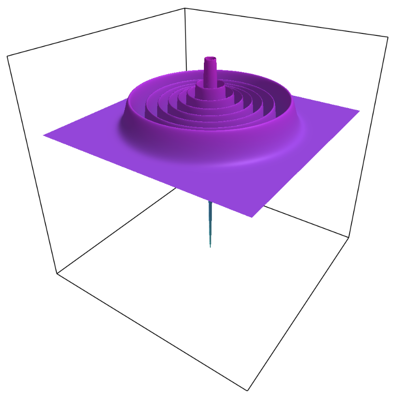

# PhaseSpaceTools

[](https://AshtonSBradley.github.io/PhaseSpaceTools.jl/dev)
[](https://github.com/AshtonSBradley/PhaseSpaceTools.jl/actions)
[](https://github.com/AshtonSBradley/PhaseSpaceTools.jl/actions/workflows/Aqua.yml)
[](https://codecov.io/gh/AshtonSBradley/PhaseSpaceTools.jl)
[](https://zenodo.org/badge/latestdoi/115932136)

Sample quantum initial states commonly encountered in quantum phase space simulations of Bose fields, including those encountered in quantum optics and Bose-Einstein condensates. 

Wigner and positive-P distributions are available, being the most useful for dynamical simulations.

Available distributions are `glauberP`, `positiveP`, `wigner`, `positiveW`, and `husimiQ`.



## Install

```julia
julia> ]add PhaseSpaceTools
```

## Quick Start

```julia
julia> using PhaseSpaceTools
julia> using Statistics

julia> α = 1.0 + 2.0im
julia> state = Coherent(α)
julia> samples, samples_conj = wigner(state, 100_000)

julia> mean(samples)
1.0 + 2.0im

julia> real(mean(samples_conj .* samples) - 0.5)
5.0
```

The returned sample moments reproduce symmetrically ordered observables in the Wigner representation.

## Implemented states

- `Bogoliubov`
- `Coherent`
- `Crescent`
- `Fock`
- `Squeezed`
- `SqueezedTwoMode`
- `Thermal`

### Coherent state
A coherent state |α⟩ is sampled as
```julia
α = 1.0+im*2.0 # coherent amplitude
s = Coherent(α) # define state |α⟩
N = 1000 # number of samples
a,a⁺ = positiveP(s,N)
```
This is a special case where the two phase space variables `a` and `a⁺` are complex conjugate, and non-stochastic in the `+P` representation.

### Fock state
An approximate Fock state sampler in the Wigner representation:
```julia
n = 100
s = Fock(n) # define number state |n⟩
N = 1000 # number of samples
a,a⁺ = wigner(s,N)
```
Provides an approximate sampling of `W` that reproduces operator averages for large `n`. For small `n`, use with care: the implementation warns that the approximation is only valid when `n ≫ 1`.

## Examples

See  `/examples/sampling.ipynb` for more usage.

# External links
___Numerical representation of quantum states in the positive-P and Wigner representations,___ \
M K Olsen, A S Bradley, \
[Optics Communications 282, 3924 (2009)](http://dx.doi.org/10.1016/j.optcom.2009.06.033)

[Scipost Commentary with full erratum](https://scipost.org/commentaries/10.1016/j.optcom.2009.06.033/)
